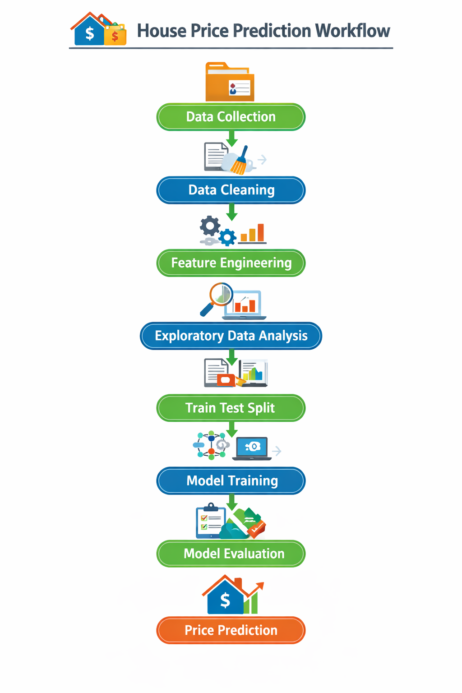

# House Price Prediction using Machine Learning

## Project Overview

This project focuses on predicting residential house prices using Machine Learning techniques by analysing various structural and geographical features of houses.

The main objective of this project is to:

- Perform data preprocessing and cleaning
- Conduct Exploratory Data Analysis (EDA)
- Handle categorical and numerical features
- Train Machine Learning models
- Evaluate model performance
- Predict house prices based on input features

This project demonstrates an end-to-end Machine Learning workflow starting from raw dataset processing to model evaluation and prediction.

---

## Dataset Description

The dataset used in this project contains information related to residential homes such as:

- Lot Area
- Building Type
- Zoning Classification
- Overall Condition
- Basement Area
- Exterior Material
- Year Built
- Year Remodeled
- Total Basement Area
- Sale Price *(Target Variable)*

The dataset contains both:

- *Categorical Features*
- *Numerical Features*

which makes it suitable for applying preprocessing techniques before training Machine Learning models.

---

## Project Workflow

The overall workflow of the project is shown below:

  

---

## Data Preprocessing

The following preprocessing steps were performed on the dataset:

- Removal of irrelevant columns
- Handling missing values
- Conversion of categorical variables into numerical format
- Feature selection for improving model performance
- Data type consistency checks
- Preparing data for Machine Learning models

Categorical variables were encoded using suitable encoding techniques to make them usable for predictive modelling.

---

## Exploratory Data Analysis (EDA)

EDA was performed to understand:

- Feature distributions
- Relationship between independent variables and house prices
- Correlation between numerical features
- Impact of building characteristics on sale price

Visualisations used:

- Correlation Heatmaps

  

- Barplot

  

- Bargraph

  

These visualisations helped in:

- Identifying patterns
- Detecting outliers
- Understanding feature importance
- Improving model selection

---

## Machine Learning Models Used

Three Machine Learning models were implemented and compared in this project:

### 1. Linear Regression
- Used as a baseline model
- Helps understand linear relationship between features and target variable
- Simple and interpretable model

### 2. Support Vector Regressor (SVR)
- Effective for capturing non-linear relationships in data
- Uses kernel functions to transform input features into higher-dimensional space
- Works well for regression tasks with complex patterns
- Robust against overfitting when properly tuned

### 3. Random Forest Regressor
- Ensemble learning method
- Reduces overfitting
- Provides better generalisation performance
- Improves prediction accuracy compared to individual decision trees

---

## Model Evaluation

The models were evaluated using appropriate regression evaluation metrics such as:

- Mean Absolute Error (MAE)
- Mean Squared Error (MSE)
- Root Mean Squared Error (MSE)
- R² Score
- Mean Absolute Percentage Error (MAPE)

| Model             | MAE      | MSE        | RMSE     | R² Score | MAPE   |
| ----------------- | -------- | ---------- | -------- | -------- | ------ |
| SVR               | 28848.68 | 2.70 × 10⁹ | 52000.90 | 0.0000   | 0.1871 |
| Random Forest     | 31839.45 | 2.10 × 10⁹ | 45885.80 | 0.2214   | 0.1918 |
| Linear Regression | 30829.94 | 1.69 × 10⁹ | 41138.56 | 0.3741   | 0.1874 |

### Interpretation

- Linear Regression achieved the highest R² Score, indicating better predictive capability.
- Random Forest showed moderate performance across evaluation metrics.
- SVR performed poorly in capturing variance in the dataset due to very low R² Score.
- Lower MAE, MSE, RMSE, and MAPE values indicate better prediction accuracy.
- Overall, *Linear Regression* performed best among the three models for this dataset.

---

## Conclusion

This project successfully demonstrates how Machine Learning models can be used to predict house prices based on multiple housing attributes.

This project highlights the importance of:

- Data preprocessing
- Feature selection
- Model evaluation
- Exploratory Data Analysis

in building an accurate predictive Machine Learning system.

---

## Future Improvements

- Hyperparameter tuning for better model performance
- Feature engineering for improved prediction
- Implementation of advanced ensemble models
- Deployment using Flask or Streamlit
- Integration with real-time housing datasets

---

## Author

### Samad Zaheer

Master of Information Technology (Data Science)  
Queensland University of Technology (QUT)

---
